<HTML>
<HEAD>
<META NAME="Author" CONTENT="">
<META NAME="GENERATOR" CONTENT="G Development Environment">
</HEAD>
<BODY BGCOLOR="#FFFFFF">
<H2>main.vi</H2>

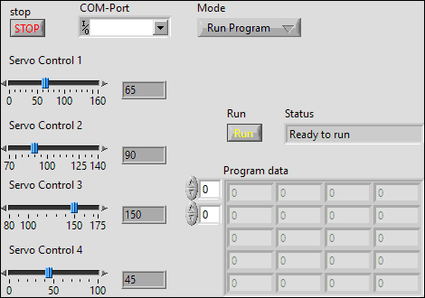

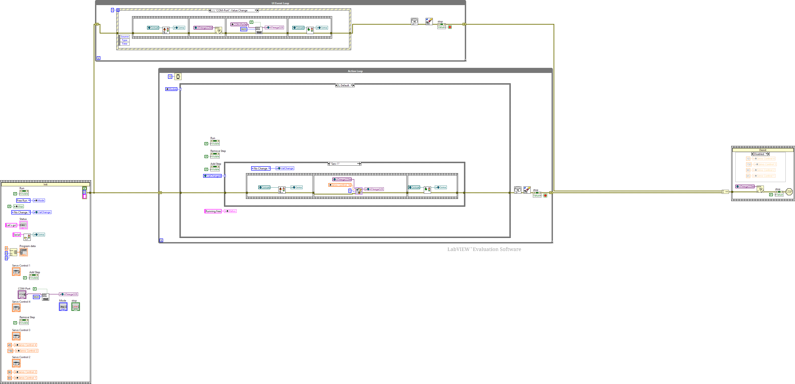

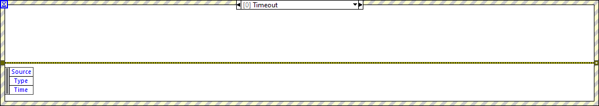

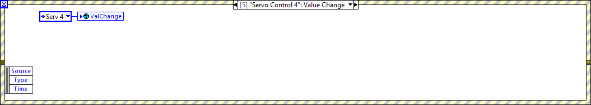

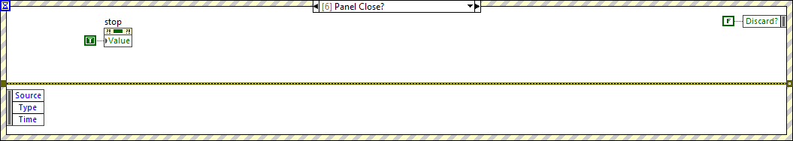

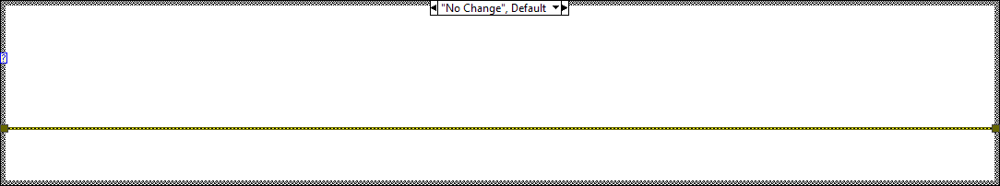

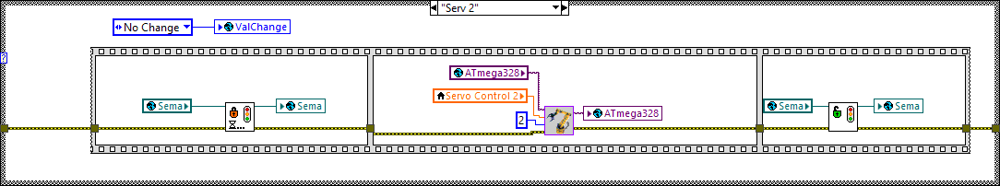

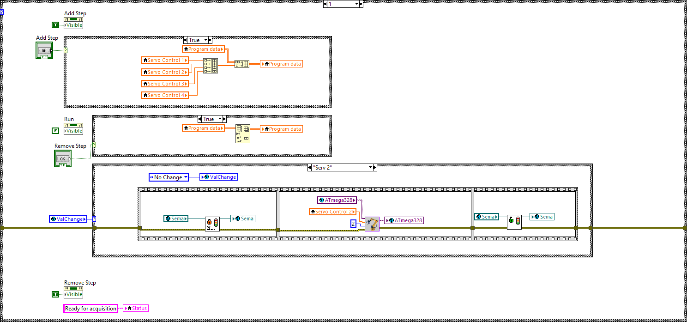

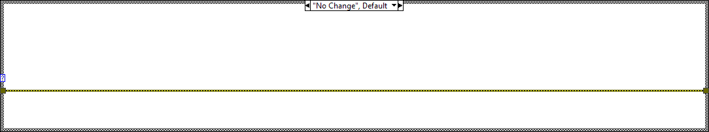

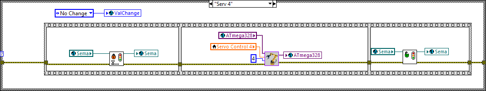

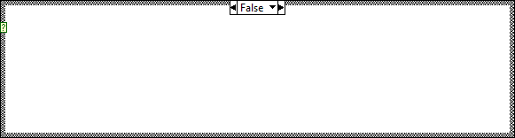

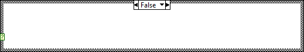

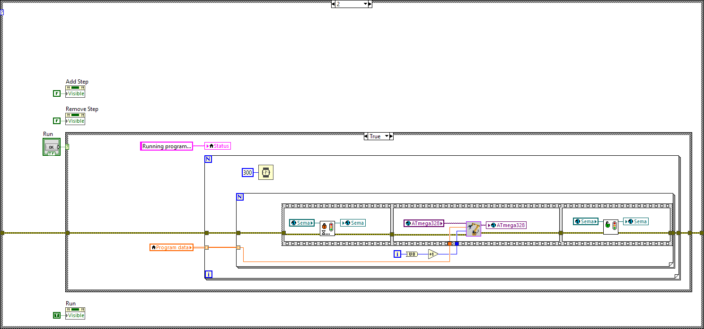

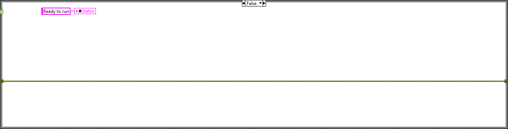

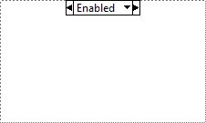

<Table>
</Table>

<H2>Servo_Write.vi</H2>

Takes a Target Value in Servo Control from 0 to 180 (degrees) and sends the according pulse length and servo index (1 to 4) to the controller.

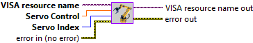

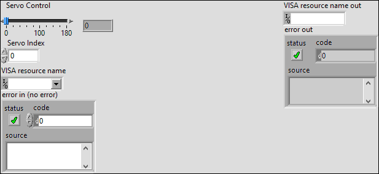

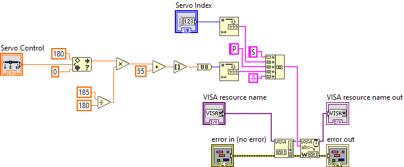

</BODY>
</HTML>
